# CCF — AI for students, by students.

> Fork of [Wei-Shaw/sub2api](https://github.com/Wei-Shaw/sub2api) · Live at **[api.ccfuck.me](https://api.ccfuck.me)**

[](https://golang.org/)
[](https://vuejs.org/)
[](LICENSE)
[](https://api.ccfuck.me)

---

## What changed

| | Upstream (ShitRouter) | This fork (CCF) |
|---|---|---|
| Brand | Sub2API | CCF · Campus · Care · Future |
| Hero | generic tagline | "AI for students, by students." |
| Palette | default blue-gray | Nord — `#81a1c1` `#88c0d0` `#a3be8c` |
| Sidebar / header | opaque dark | glassmorphism + dot-grid backdrop |
| Cards / tables | solid fills | `backdrop-filter: blur` frosted glass |
| Theme toggle | — | `document.documentElement.classList.toggle('no-glass')` |
| Font | system-ui | Space Grotesk (hero), gradient text |

---

## Home

| Before | After |
|--------|-------|
| 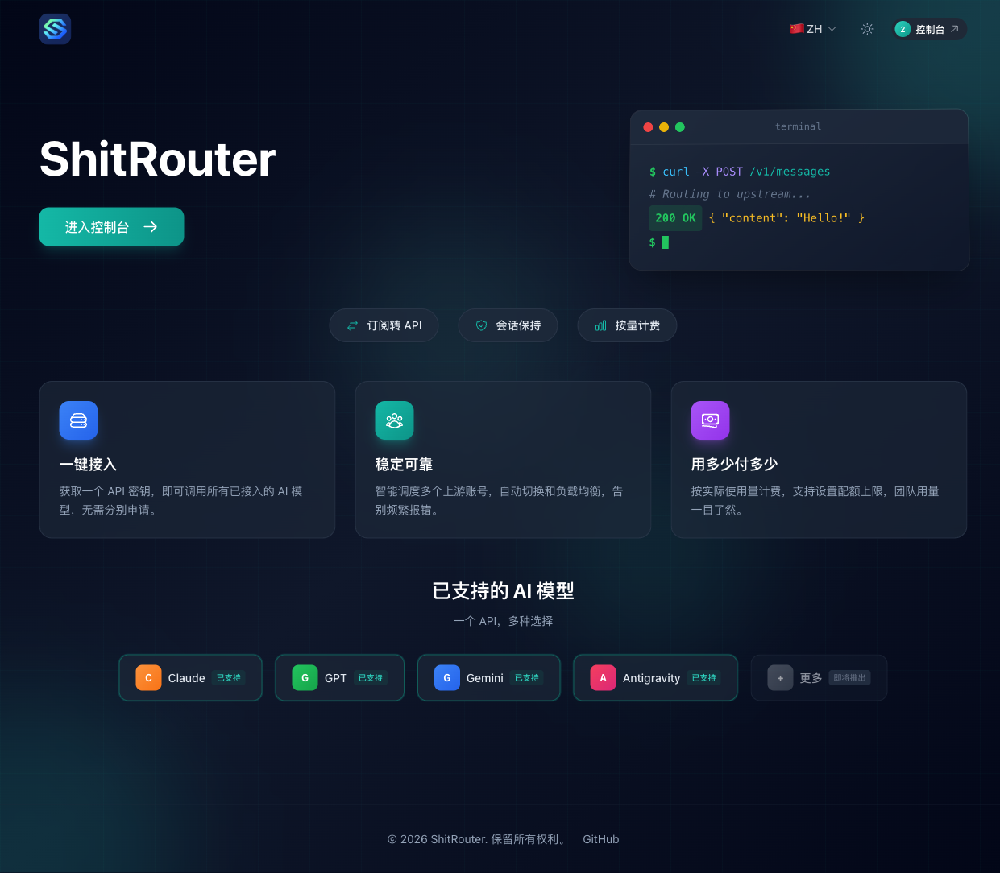 | 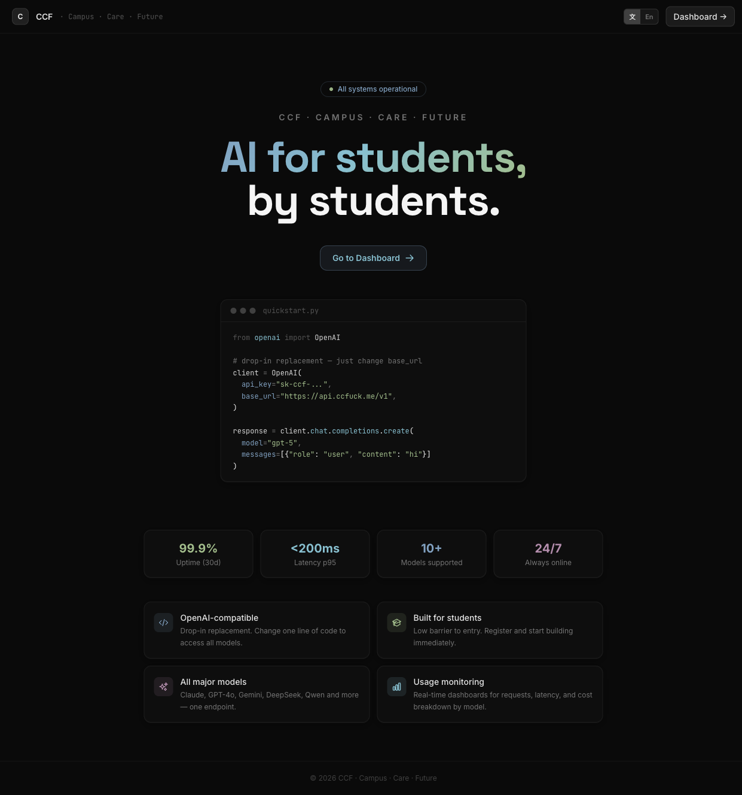 |

## Dashboard

| Before | After |
|--------|-------|
| 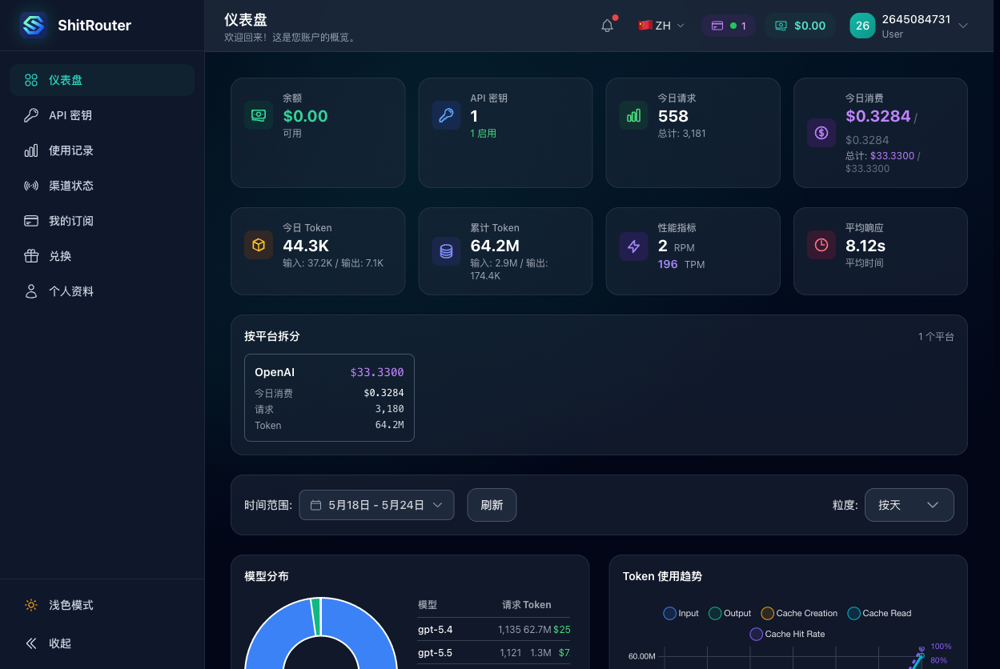 | 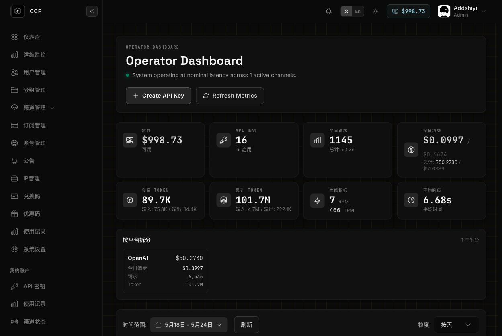 |

## API Keys

| Before | After |
|--------|-------|
| 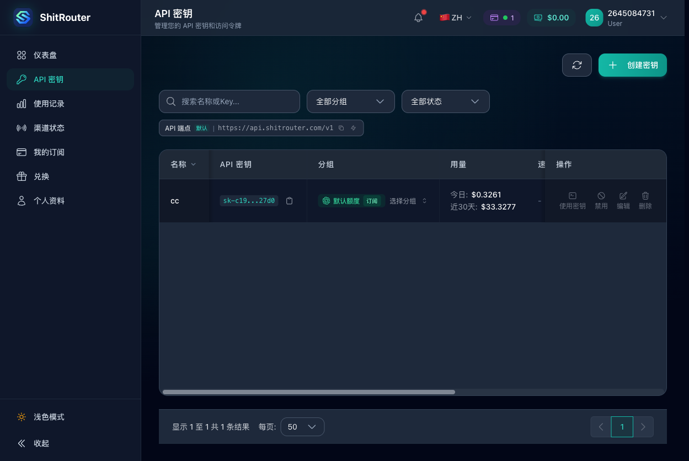 | 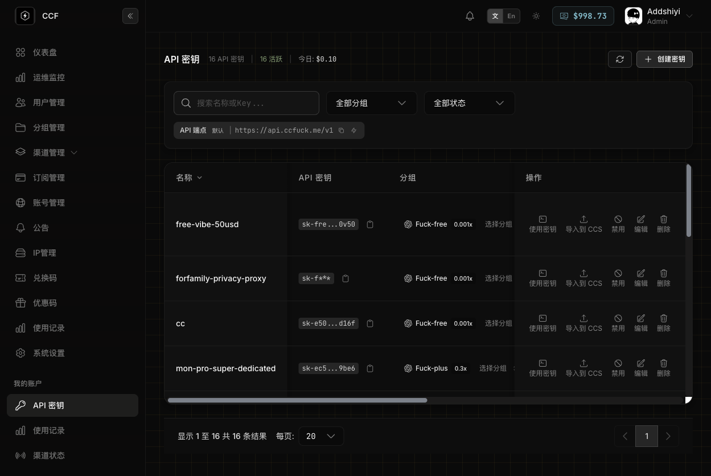 |

## Usage

| Before | After |
|--------|-------|
| 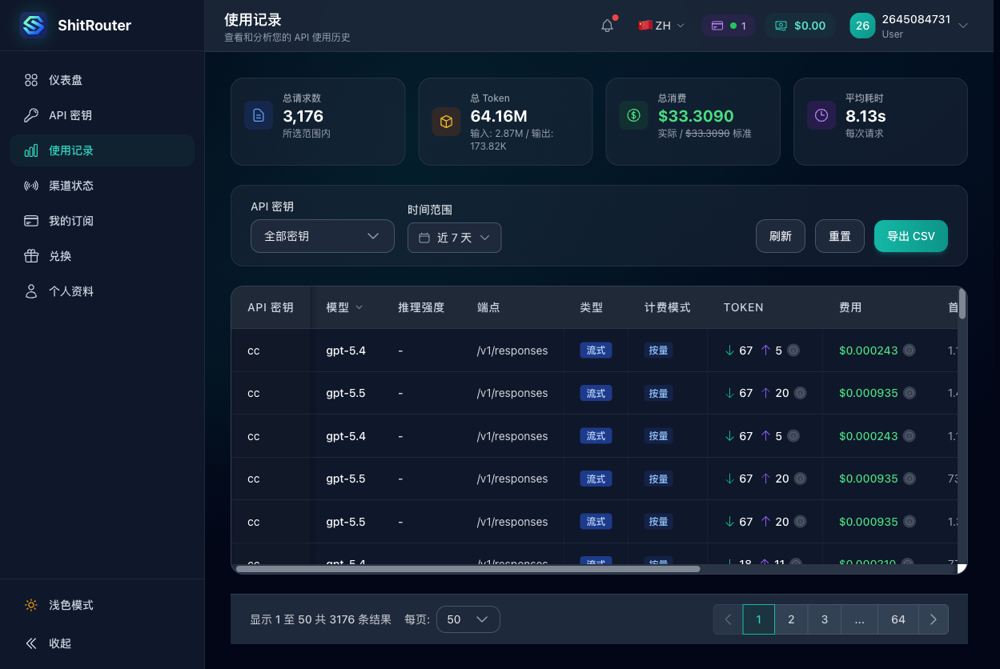 | 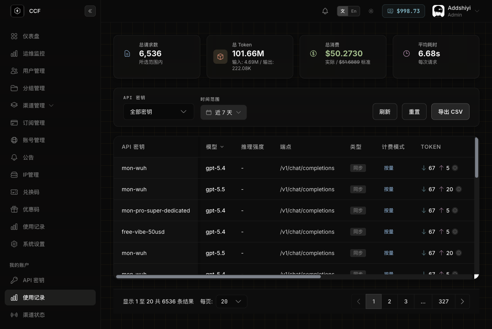 |

## Channel Monitor

| Before | After |
|--------|-------|
| 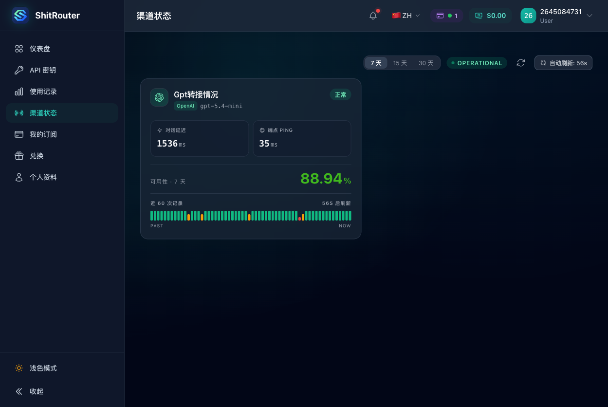 | 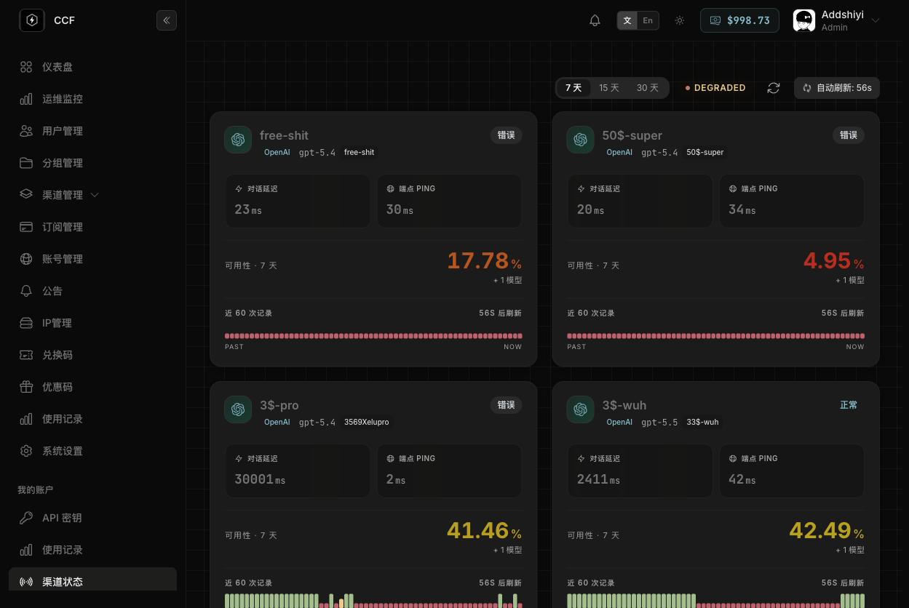 |

## Profile

| Before | After |
|--------|-------|
| 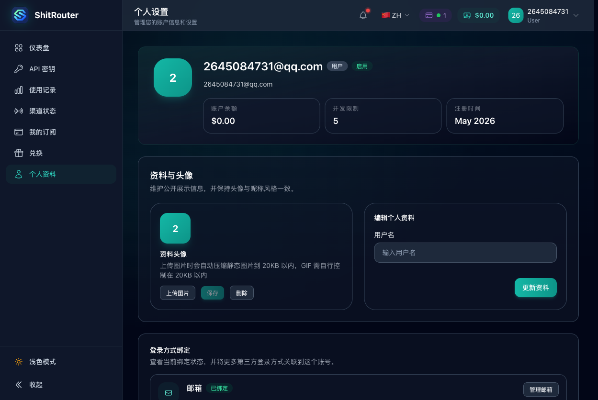 | 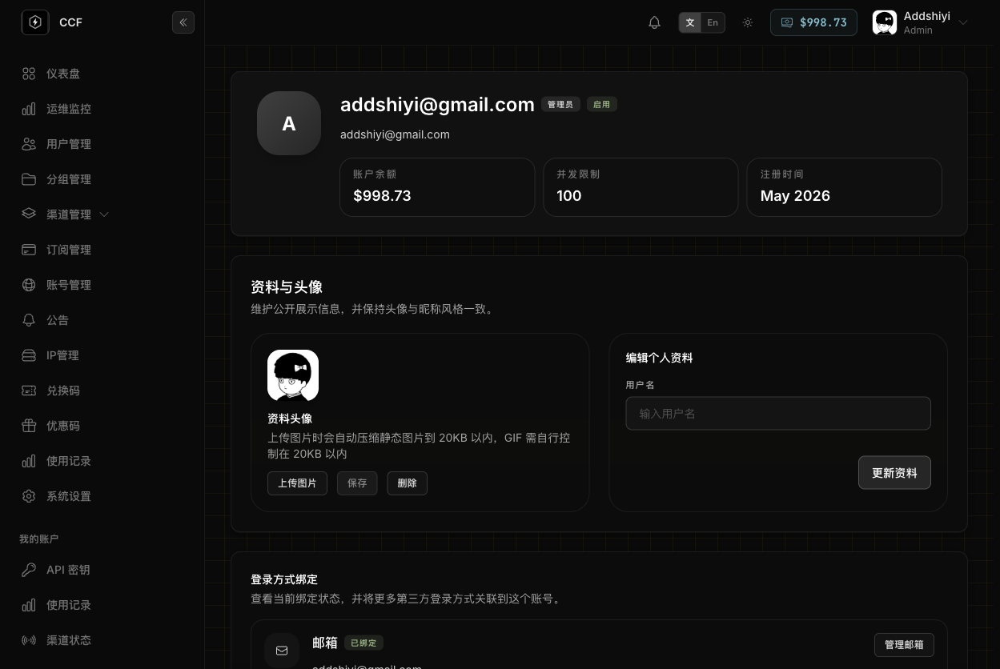 |

---

## Stack

Go · Gin · Ent · Vue 3 · Vite · Tailwind CSS · PostgreSQL · Redis

## Quick deploy

```bash
# build embedded binary
cd backend && go build -tags embed -o sub2api ./cmd/server

# ship to VPS
scp sub2api root@your-vps:/opt/sub2api/current/
ssh root@your-vps "systemctl restart sub2api"
```

Config: `/etc/sub2api/sub2api.env` — see `deploy/systemd-release.env.example`.

---

## Connect & Support

<p align="center">
  
  &nbsp;&nbsp;&nbsp;&nbsp;&nbsp;&nbsp;
  
  <br/><br/>
  <sub>Add me on WeChat &nbsp;&nbsp;&nbsp;&nbsp;&nbsp;&nbsp; Buy me a coffee ☕</sub>
</p>

---

All gateway logic from upstream. See [Wei-Shaw/sub2api](https://github.com/Wei-Shaw/sub2api) for full docs.

[GNU LGPL v3.0](LICENSE)
